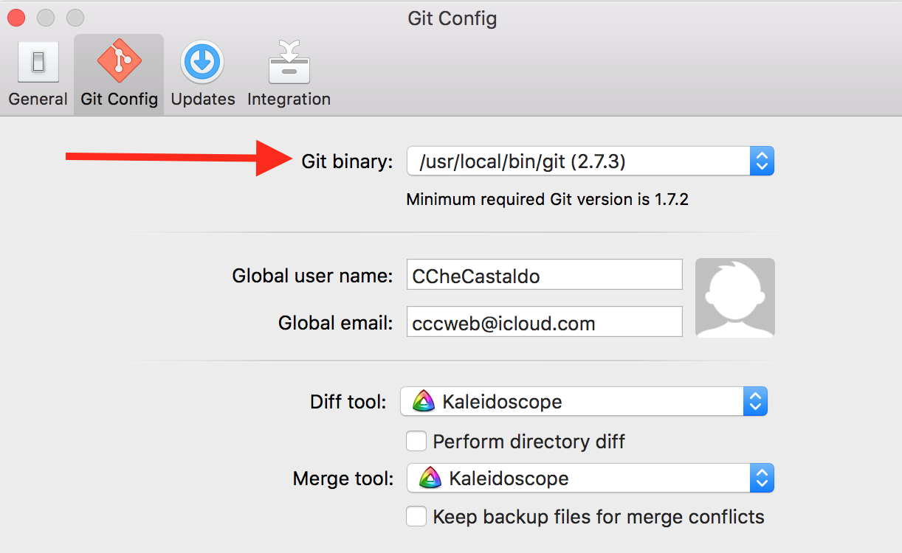
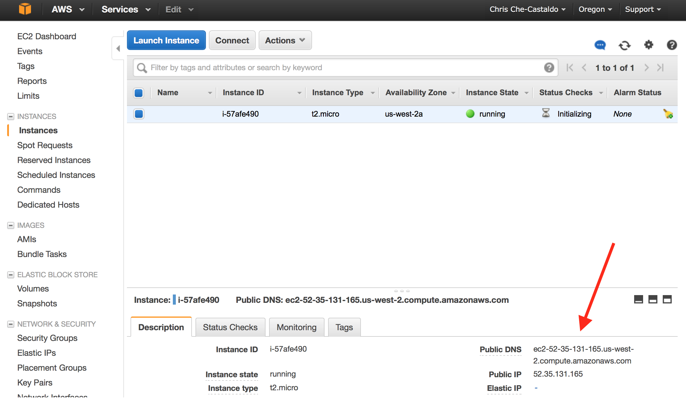
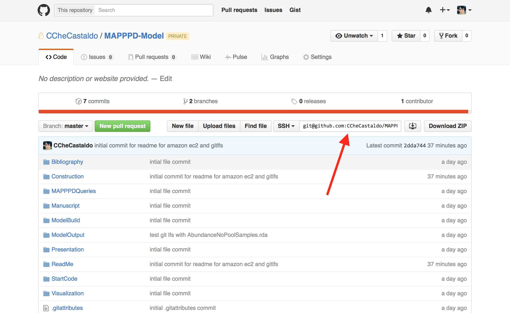

#### Using Amazon EC2 to run Bayesian Models
#### Chris Che-Castaldo & Ben Weinstein
#### `r format(Sys.Date(), format="%B %d, %Y")`

- - -
#### Table of Contents

[I. Installing and configuring Git LFS locally][]

[II. Using SSH with your Git repository][]

[III. Configuring and launching an Amazon EC2 instance][]

[IV. Accessing an Amazon EC2 instance in the browser][]

[V. Accessing an Amazon EC2 instance via SSH][]

[VI. Cloning a Git repository on your Amazon EC2 instance][]

[VI. Automating this entire process with bash scripts][]


```{r preliminaries, include=FALSE}
rm(list=ls())
library(knitr)
knitr::opts_chunk$set(cache=FALSE, warnings=FALSE, tidy=FALSE)
set.seed(5)
```

<br>

#### I. Installing and configuring Git LFS locally

You will need Git LFS if you plan to commit any files > 100 MB in size. The MCMC output from the penguin model could easily exceed this size given the number of parameters involved, making Git LFS a must. This section describes installing Git LFS locally. Later on we describe how to install Git LFS on your EC2 instance, as it does not come pre-installed with the AMI we will be working with. Remeber, Git LFS costs money, and you first need to subscribe to this service on [GitHub](http://www.github.com).

Getting Git LFS to work correctly on the Mac can be confusing, so here are the steps. **Make sure you do not have any large files (>100MB) commits before doing this!**

1.  Install homebrew from the terminal.

    ```bash
    bash /usr/bin/ruby -e "$(curl -fsSL https://raw.githubusercontent.com/Homebrew/install/master/install)
    ```

2.  Install Git LFS using homebrew.

    ```bash
    brew install git-lfs
    ```

3.  Make sure that Git and Git LFS are both located in the same directory, your `/usr/local/bin`.

4.  Add /usr/local/bin to your path.

    ```bash
    echo 'export PATH="/usr/local/bin:/usr/local/sbin:~/bin:$PATH"' >> ~/.bash_profile
    ```

5.  Type `which git` in the terminal to make sure you are using the git installation in `/usr/local/bin`.

6.  If using Tower, select this version of git under Preferences, Git Config:

<br><center>
<div style="width:500px; height=500px">

</div>
<br></center>

7.  Before you do any commits involving large files, either create or amend the .gitattributes file to associate a file type with Git LFS. From the terminal type 
    ```bash 
    git lfs track *.*
    ```
    
    where the astericks indicate which names or extensions of file you wish to associate with Git LFS. In our case this will be all rda files so type
    
    ```bash
    git lfs track *.rda
    ```
8.  Commit this change to .gitattributes and push it to the remote repository.

<br>

#### II. Using SSH with your Git repository

We will know generate an SSH key (two files - a public key that you share and a private key you keep safe) that we associate with our Git account. This will allow us to clone our Git repository on an EC2 instance without having to manually type in your username and password or (worse yet) put your password in cleartext when using a script.

1.  In terminal create an SSH key, substituting your email address.

    ```bash
    SSH-keygen -t rsa -b 4096 -C your_email@example.com
    ```

2.  Save the key to the default directory, `~/.ssh`.

3.  Skip entering a pass-phrase.

4.  Check that the public and private key are in  `~/.ssh` by going to the directory and typing `ls -l id_rsa*`. You should see two files, the public key named         `id_rsa.pub` and the private key named `id_rsa`.

    ```bash
    -rw-r--r--  1 coldwater  staff  3243 Mar 15 10:19 id_rsa
    -rw-r--r--  1 coldwater  staff   743 Mar 15 10:19 id_rsa.pub
    ```
5. From the terminal, make sure this private key is not publically viewable. 

    ```bash
    chmod 600 ~/.ssh/keyname
    ```

    For me, this is:
    
    ```bash
    chmod 600 ~/.ssh/id_rsa
    ```
    
6.  Check that this worked by typing `ls -l id_rsa*`. Notice that now the private key can only be read and written to by me, while the public key can still be read by everyone.
    
    ```bash
    -rw-------  1 coldwater  staff  3243 Mar 15 10:19 id_rsa
    -rw-r--r--  1 coldwater  staff   743 Mar 15 10:19 id_rsa.pub
    ```
    
7.  Go to the settings under your [GitHub account](http//www.github.com).

8.  Click SSH keys and New SSH key.

9.  In terminal copy your public key to the clipboard.

    ```bash
    pbcopy < ~/.ssh/id_rsa.pub
    ```
10.  Paste this into the key box on github.com and click save. This key is available to ALL your Git repositories.

<br>

#### III. Configuring and launching an Amazon EC2 instance

OK, let's configure and launch our Amazon EC2 instance. We can access it via the browser, as well as SSH from the terminal. An instance is a virtual machine that runs an AMI, which specifices its software configuration. You can start with a bare-bones unbuntu image and install R, etc, but that is time consuming. Fortunately, there are many community AMI's available that are preconfigured for different tasks.  Louis Aslett has created an [RStudio Server AMI](http://www.louisaslett.com/RStudio_AMI/) that we will use.

1.  Go to the [EC2 Dashboard](https://us-west-2.console.aws.amazon.com/ec2/v2/home?region=us-west-2#) under the AWS Management Console.

2.  Make sure the region selected in the top right is as close to you as possible. If not change it.

3.  Click launch instance.

4.  Click community AMIs, and type in `ami-1d7f657c`. This is the [RStudio Server AMI](http://www.louisaslett.com/RStudio_AMI/) matching my region (Oregon).

5.  Select Free-Tier eligible to get started. Later as you do more intensive runs, you can alter these hardware settings.

6.  Under configure instance details, select `terminate` under shutdown behavior. Leave the other options as is.

7.  Leave storage and tag instance options as is.

8.  Under security group, click add rule, and select HTTP. These rules are what allow you to connect to your instance via the web (port 80) or via SSH (port 22). Don't worry about the warning. Nobody can access this instance without your private key, which only you have.

9.  Click launch instance and select create a key pair. Name and download your private key. Remove the .txt extension from the private key. Move the key to `~/.ssh` by typing in the terminal 

    ```bash
    mv /path/keyname.pem ~/.ssh/keyname.pem
    ```

    For me, that would be:

    ```bash
    mv /Users/coldwater/Downloads/CheCastaldoAmazon.pem ~/.ssh/CheCastaldoAmazon.pem
    ```

10. In the terminal, make sure this private key is not publically viewable.

    ```bash
    chmod 400 /path/keyname.pem
    ``` 
    For me that would be 
    
    ```bash
    chmod 400 ~/.ssh/CheCastaldoAmazon.pem
    ```

11.  Check that this worked by typing `ls -l CheCastaldoAmazon.pem`. Notice that access to this file is even more restricted than the Git private key.
    
    ```bash
    -r--------@ 1 coldwater  staff  1692 Mar 15 11:42 CheCastaldoAmazon.pem
    ```
    
11. Click view instances. From this screen you can control your instance, as well as make changes to it. Note, stopping your instance is not the same as terminating it. If you want to kill an instance, you must use terminate.

<br>

#### IV. Accessing an Amazon EC2 instance in the browser

Once you instance state is green (running) you can access it from the terminal or through the web browser. 

1.  From the web, copy the Public DNS link and paste it into a new browser tab. 

<br><center>
<div style="width:750px; height=750px">

</div>
<br></center>

2. Log in to R studio using the username `rstudio` and the password `rstudio`. Welcome to your Amazon EC2 instance! To access the command line here, click shell, under tools. 

<br>

#### V. Accessing an Amazon EC2 instance via SSH

Here we access your instance via SSH from the terminal. Why do this? Simple - script automation and scalability.

1. First we will, secure copy our Git Hub private key to the ec2 instance. That way it is there when we log in and we can clone our Git repository. To do this move to the `~/.ssh` directory in terminal and type:

    ```bash
    scp -i ~/.ssh/AmazonPrivateKeyname.pem GitPrivateKeyname user_name@public_dns_name:~/.ssh/
    ```

    For me this is:

    ```bash
    scp -i ~/.ssh/CheCastaldoAmazon.pem id_rsa ubuntu@ec2-52-35-131-165.us-west-2.compute.amazonaws.com:~/.ssh/
    ```

2. Now, from the terminal, SSH into your instance. 

    ```bash
    ssh -i /path/AmazonPrivateKey.pem user_name@public_dns_name
    ```
    
    For me this is:
      
    ```bash    
    ssh -i ~/.ssh/CheCastaldoAmazon.pem ubuntu@ec2-52-35-131-165.us-west-2.compute.amazonaws.com
    ```
    
    After which you will say yes and see something similar to the following. Again, welcome to your Amazon EC2 instance!
    
    ```bash
    The authenticity of host 'ec2-52-35-131-165.us-west-2.compute.amazonaws.com (52.35.131.165)' can't be established.
    ECDSA key fingerprint is SHA256:iwfo8uhyBDJAthQQjxWnkcRSKK9XqE+0hSmr96zLHRQ.
    Are you sure you want to continue connecting (yes/no)? yes
    Warning: Permanently added 'ec2-52-35-131-165.us-west-2.compute.amazonaws.com,52.35.131.165' (ECDSA) to the list of known hosts.
    Welcome to Ubuntu 14.04.3 LTS (GNU/Linux 3.13.0-74-generic x86_64)

    * Documentation:  https://help.ubuntu.com/

    System information as of Tue Mar 15 16:45:10 UTC 2016

    System load: 0.52              Memory usage: 5%   Processes:       81
    Usage of /:  44.3% of 9.71GB   Swap usage:   0%   Users logged in: 0

    Graph this data and manage this system at:
    https://landscape.canonical.com/

    Get cloud support with Ubuntu Advantage Cloud Guest:
    http://www.ubuntu.com/business/services/cloud


    ubuntu@ip-172-31-30-91:~$ 
    ```

3. Type `ls -l ~/.ssh` and you should see your Git private key, with appropriate permissions, saved in the `~/.ssh` folder.

    ```bash
    -rw------- 1 ubuntu ubuntu  399 Mar 15 16:45 authorized_keys
    -rw------- 1 ubuntu ubuntu 3243 Mar 15 18:32 id_rsa
    ```
    
4. FYI, to logout, type `exit`. Note this doesn't kill the EC2 instance! You are just logged out of it. Go back to the [EC2 Dashboard](https://us-west-2.console.aws.amazon.com/ec2/v2/home?region=us-west-2#) and your instance still will be running.

<br>

#### VI. Cloning a Git repository on your Amazon EC2 instance
 
The good news is git is installed be default on this AMI. However, the bad news is we still need to install Git LFS and securely get our private key onto our instance so we can clone our repository.

1. From the terminal, run a script that allows us to install Git LFS using apt-get utility.

    ```bash
    curl -s https://packagecloud.io/install/repositories/github/git-lfs/script.deb.sh | sudo bash
    ```

2. Now install Git LFS. 

    ```bash
    sudo apt-get install git-lfs
    ```

3. Typing `which git` shows the Git install in `/usr/bin/` on your instance. Typing `ls -l /usr/bin/git*` shows Git and Git LFS in the same folder, which is exactly where they need to be.

4. Go to the repository you wish to clone on [GitHub account](http//www.github.com) and copy the SSH link for the master branch under the code tab.

<br><center>
<div style="width:750px; height=750px">

</div>
<br></center>

5. In the terminal, move to the home directory and then clone the master branch to this Amazon EC2 instance.

    ```bash
    cd /home
    sudo git clone git@github.com:CCheCastaldo/MAPPPD-Model.git
    ```
    


